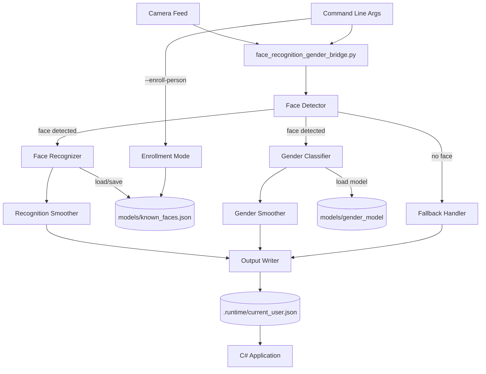
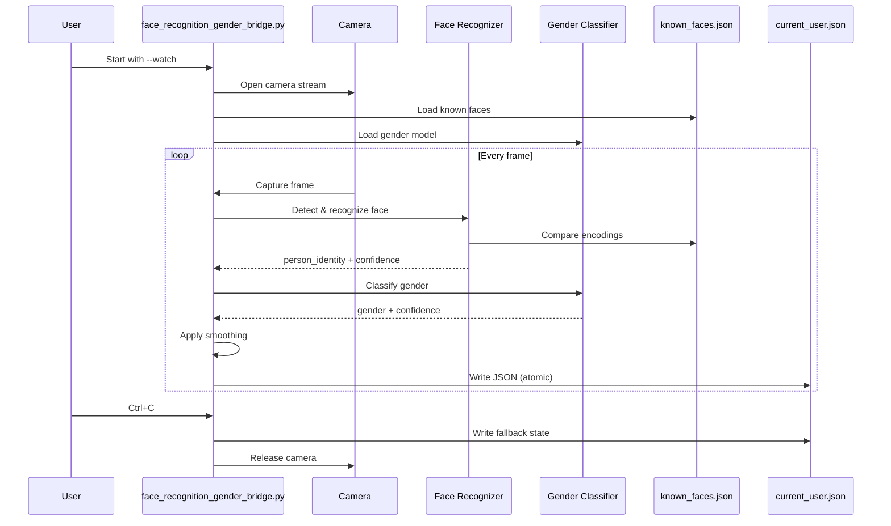

# Design Document: Face Identification and Gender Detection Bridge

## Overview

This document specifies the design for a **standalone face identification and gender detection bridge** that operates independently from other camera bridges. The system detects faces through a camera, identifies specific individuals from a known database, classifies gender, and writes detection results to `.runtime/current_user.json` for consumption by other system components.

### Design Goals

1. **Standalone Architecture**: Independent Python script that can be tested and run without other bridges
2. **Face Recognition**: Identify specific individuals using face_recognition library (dlib-based)
3. **Gender Classification**: Classify detected faces using pre-trained deep learning models
4. **Persistent Database**: Store face encodings in JSON format for recognition across sessions
5. **Enrollment Mode**: Allow administrators to add new people to the recognition database
6. **Runtime Communication**: Write detection results to JSON files for inter-process communication
7. **Privacy-First**: All processing happens locally without external API calls

### Architecture Pattern

The design follows the same standalone bridge pattern as `Face emotion bridge.py`:
- Single-purpose Python script in `bridge/` directory
- Camera capture with OpenCV
- Command-line interface for configuration
- JSON output to `.runtime/` directory
- Optional preview window for debugging
- Watch mode for continuous operation

## Architecture

### High-Level System Diagram



### Component Interaction Flow



## Components and Interfaces

### 1. Face Detector Component

**Responsibility**: Detect human faces in camera frames

**Implementation**: `face_recognition` library's `face_locations()` function

**Interface**:
```python
class FaceDetector:
    def detect_faces(self, frame: np.ndarray) -> List[Tuple[int, int, int, int]]:
        """
        Detect faces in frame.
        
        Args:
            frame: BGR image from OpenCV
            
        Returns:
            List of (top, right, bottom, left) bounding boxes
        """
        pass
    
    def get_largest_face(self, face_locations: List[Tuple]) -> Optional[Tuple]:
        """
        Select the largest face by bounding box area.
        
        Args:
            face_locations: List of face bounding boxes
            
        Returns:
            Largest face bounding box or None
        """
        pass
```

**Performance Requirements**:
- Process frames at minimum 5 FPS
- Use HOG-based detection for speed (not CNN)
- Select largest face when multiple detected

### 2. Face Recognizer Component

**Responsibility**: Identify specific individuals by matching face encodings

**Implementation**: `face_recognition` library with custom database management

**Interface**:
```python
class FaceRecognizer:
    def __init__(self, database_path: Path):
        """Load known faces from JSON database."""
        pass
    
    def encode_face(self, frame: np.ndarray, face_location: Tuple) -> Optional[np.ndarray]:
        """
        Extract 128-dimensional face encoding.
        
        Args:
            frame: BGR image from OpenCV
            face_location: (top, right, bottom, left) bounding box
            
        Returns:
            128-d encoding vector or None if encoding fails
        """
        pass
    
    def recognize(self, face_encoding: np.ndarray) -> Tuple[str, float]:
        """
        Match encoding against database.
        
        Args:
            face_encoding: 128-d vector from encode_face()
            
        Returns:
            (person_name, confidence) where confidence is 1.0 - distance
            Returns ("unknown", 0.0) if no match above threshold
        """
        pass
    
    def add_person(self, name: str, encoding: np.ndarray) -> None:
        """Add or update person in database."""
        pass
    
    def save_database(self) -> None:
        """Persist database to disk."""
        pass
```

**Algorithm Details**:
- **Encoding**: Use `face_recognition.face_encodings()` to extract 128-d dlib face embeddings
- **Matching**: Compute Euclidean distance between query encoding and all database encodings
- **Threshold**: Match if distance < 0.4 (equivalent to confidence > 0.6)
- **Confidence**: Convert distance to confidence: `confidence = max(0.0, 1.0 - distance)`
- **Multiple Encodings**: Support multiple encodings per person (different angles/expressions)
- **Best Match**: Select the encoding with minimum distance across all people

**Smoothing Strategy**:
- **EMA Smoothing**: Apply exponential moving average to recognition confidence over 2-second window
- **Stability Threshold**: Require new identity to persist for 1.5 seconds before accepting change
- **Alpha Parameter**: Use α = 0.3 for EMA (70% previous, 30% current)

### 3. Gender Classifier Component

**Responsibility**: Classify detected faces as male or female

**Implementation**: Pre-trained deep learning model (DeepFace or custom)

**Interface**:
```python
class GenderClassifier:
    def __init__(self, model_path: Path):
        """Load pre-trained gender classification model."""
        pass
    
    def classify(self, frame: np.ndarray, face_location: Tuple) -> Tuple[str, float]:
        """
        Classify gender of detected face.
        
        Args:
            frame: BGR image from OpenCV
            face_location: (top, right, bottom, left) bounding box
            
        Returns:
            (gender, confidence) where gender is "male", "female", or "unknown"
            confidence is probability score 0.0-1.0
        """
        pass
    
    def preprocess_face(self, frame: np.ndarray, face_location: Tuple) -> np.ndarray:
        """
        Extract and preprocess face region for model input.
        
        Args:
            frame: BGR image
            face_location: Bounding box
            
        Returns:
            Preprocessed face tensor ready for model
        """
        pass
```

**Model Options**:
1. **DeepFace** (Recommended): Use `DeepFace.analyze()` with `actions=['gender']`
2. **Custom Model**: Pre-trained CNN (VGG16, ResNet) fine-tuned on gender classification
3. **Format**: ONNX or PyTorch (.pth) format

**Algorithm Details**:
- **Preprocessing**: Resize face to model input size (typically 224x224), normalize pixel values
- **Inference**: Forward pass through CNN to get gender probabilities
- **Threshold**: Output "unknown" if max probability < 0.5
- **Performance**: Target < 100ms inference time on CPU

**Smoothing Strategy**:
- **EMA Smoothing**: Apply exponential moving average to gender probabilities over 2-second window
- **Stability Threshold**: Require new gender to persist for 1.0 seconds before accepting change
- **Alpha Parameter**: Use α = 0.4 for EMA (60% previous, 40% current)

### 4. Person Database Component

**Responsibility**: Persist and manage known face encodings

**Implementation**: JSON file storage with in-memory caching

**Interface**:
```python
class PersonDatabase:
    def __init__(self, database_path: Path):
        """Load or create database file."""
        pass
    
    def load(self) -> Dict[str, List[List[float]]]:
        """Load database from disk."""
        pass
    
    def save(self, data: Dict[str, List[List[float]]]) -> None:
        """Save database to disk atomically."""
        pass
    
    def add_encoding(self, person_name: str, encoding: np.ndarray) -> None:
        """Add encoding to person's entry."""
        pass
    
    def get_all_encodings(self) -> List[Tuple[str, np.ndarray]]:
        """Get all (name, encoding) pairs for matching."""
        pass
```

**File Format**: See Data Models section below

### 5. Enrollment Mode Component

**Responsibility**: Capture and store face encodings for new people

**Interface**:
```python
class EnrollmentMode:
    def __init__(self, person_name: str, database: PersonDatabase, target_samples: int = 5):
        """Initialize enrollment for person."""
        pass
    
    def add_sample(self, encoding: np.ndarray) -> bool:
        """
        Add encoding sample.
        
        Returns:
            True if enrollment complete, False if more samples needed
        """
        pass
    
    def get_progress(self) -> Tuple[int, int]:
        """Return (current_samples, target_samples)."""
        pass
```

**Enrollment Process**:
1. User runs: `python face_recognition_gender_bridge.py --enroll-person --person-name "Ahmed"`
2. Bridge captures frames and detects faces
3. For each detected face, extract encoding and add to samples
4. Require samples from different angles (track face position variance)
5. After 5 samples collected, save to database and exit
6. Display progress in console and preview window

### 6. Output Writer Component

**Responsibility**: Write detection results to JSON file atomically

**Interface**:
```python
class OutputWriter:
    def __init__(self, output_path: Path):
        """Initialize writer with output file path."""
        pass
    
    def write_detection(self, person_identity: str, recognition_conf: float,
                       gender: str, gender_conf: float, face_detected: bool) -> None:
        """Write detection results atomically."""
        pass
    
    def write_fallback(self) -> None:
        """Write fallback state (no face detected)."""
        pass
```

**Atomic Write Strategy**:
1. Write to temporary file: `.runtime/current_user.tmp`
2. Call `os.replace()` to atomically rename to `.runtime/current_user.json`
3. Ensures C# application never reads partial/corrupted JSON

### 7. Smoothing Component

**Responsibility**: Apply temporal smoothing to reduce jitter

**Interface**:
```python
class ExponentialSmoother:
    def __init__(self, alpha: float, stability_window: float):
        """
        Initialize smoother.
        
        Args:
            alpha: EMA weight for new values (0.0-1.0)
            stability_window: Seconds to maintain value before accepting change
        """
        pass
    
    def update(self, value: Any, confidence: float, timestamp: float) -> Tuple[Any, float]:
        """
        Update with new value and return smoothed result.
        
        Args:
            value: New detection value (person name or gender)
            confidence: Confidence score for new value
            timestamp: Current timestamp
            
        Returns:
            (smoothed_value, smoothed_confidence)
        """
        pass
    
    def reset(self) -> None:
        """Reset smoother state."""
        pass
```

**Smoothing Algorithm**:
```python
# EMA for confidence scores
smoothed_conf = alpha * new_conf + (1 - alpha) * prev_conf

# Stability check for categorical values (person identity, gender)
if new_value != current_value:
    if time_since_change < stability_window:
        return current_value  # Reject change, too soon
    else:
        current_value = new_value  # Accept change
        time_since_change = 0
```

## Data Models

### 1. Known Faces Database Schema

**File**: `models/known_faces.json`

```json
{
  "version": "1.0",
  "people": [
    {
      "person_id": "uuid-string",
      "name": "Ahmed",
      "encodings": [
        [0.123, -0.456, 0.789, ...],  // 128-d vector
        [0.124, -0.455, 0.788, ...]   // Multiple samples
      ],
      "created_at": "2025-01-15T10:30:00Z",
      "updated_at": "2025-01-15T10:30:00Z"
    },
    {
      "person_id": "uuid-string",
      "name": "Youssef",
      "encodings": [
        [0.321, -0.654, 0.987, ...],
        [0.322, -0.653, 0.986, ...],
        [0.320, -0.655, 0.988, ...]
      ],
      "created_at": "2025-01-16T14:20:00Z",
      "updated_at": "2025-01-16T14:20:00Z"
    }
  ]
}
```

**Field Descriptions**:
- `version`: Schema version for future compatibility
- `person_id`: Unique identifier (UUID v4)
- `name`: Human-readable name for recognition output
- `encodings`: Array of 128-d face encoding vectors (multiple samples per person)
- `created_at`: ISO 8601 timestamp of first enrollment
- `updated_at`: ISO 8601 timestamp of last update

**Validation Rules**:
- Each encoding must be exactly 128 floats
- Name must be non-empty string
- Minimum 1 encoding per person, recommended 3-5

### 2. Runtime State Schema

**File**: `.runtime/current_user.json`

```json
{
  "person_identity": "Ahmed",
  "recognition_confidence": 0.8234,
  "gender": "male",
  "gender_confidence": 0.9123,
  "face_detected": true,
  "timestamp": "2025-01-15T10:35:42.123Z"
}
```

**Field Descriptions**:
- `person_identity`: Recognized person name or "unknown"
- `recognition_confidence`: Face recognition confidence (0.0-1.0)
- `gender`: "male", "female", or "unknown"
- `gender_confidence`: Gender classification confidence (0.0-1.0)
- `face_detected`: Boolean indicating if face is present
- `timestamp`: ISO 8601 timestamp with milliseconds

**Fallback State** (no face detected):
```json
{
  "person_identity": "unknown",
  "recognition_confidence": 0.0,
  "gender": "unknown",
  "gender_confidence": 0.0,
  "face_detected": false,
  "timestamp": "2025-01-15T10:35:42.123Z"
}
```

### 3. Command-Line Interface

**Script Name**: `bridge/face_recognition_gender_bridge.py`

**Arguments**:
```
python face_recognition_gender_bridge.py [OPTIONS]

Detection Mode Options:
  --camera-index INT        Camera device index (default: 0)
  --show-preview           Display video preview window with overlays
  --watch                  Run continuously until Ctrl+C
  --interval FLOAT         Seconds between detections (default: 0.5)
  --database PATH          Path to known faces database (default: models/known_faces.json)
  --gender-model PATH      Path to gender model (default: models/gender_model.onnx)
  --recognition-threshold  Minimum confidence for recognition (default: 0.6)
  --gender-threshold       Minimum confidence for gender (default: 0.5)

Enrollment Mode Options:
  --enroll-person          Activate enrollment mode
  --person-name STRING     Name of person to enroll (required with --enroll-person)
  --samples INT            Number of encoding samples to capture (default: 5)

Utility Options:
  --list-cameras           List available camera indices and exit
  --help                   Show help message
```

**Example Usage**:
```bash
# Normal detection mode (single frame)
python face_recognition_gender_bridge.py --camera-index 0

# Continuous detection with preview
python face_recognition_gender_bridge.py --watch --show-preview

# Enroll new person
python face_recognition_gender_bridge.py --enroll-person --person-name "Ahmed" --show-preview

# List available cameras
python face_recognition_gender_bridge.py --list-cameras
```

## Error Handling

### Error Categories and Strategies

#### 1. Camera Errors

**Scenarios**:
- Camera not available at startup
- Camera disconnected during operation
- Camera access denied (permissions)

**Handling**:
```python
def handle_camera_error(camera_index: int) -> None:
    """Handle camera initialization failure."""
    print(f"[ERROR] Cannot open camera index {camera_index}", file=sys.stderr)
    print("[ERROR] Use --list-cameras to check available cameras", file=sys.stderr)
    write_fallback_state()
    sys.exit(1)

def handle_camera_disconnect() -> None:
    """Handle camera disconnection during operation."""
    print("[WARNING] Camera disconnected. Writing fallback state.", file=sys.stderr)
    write_fallback_state()
    # Continue polling for camera availability
    while True:
        cap = cv2.VideoCapture(camera_index)
        if cap.isOpened():
            print("[INFO] Camera reconnected.", file=sys.stderr)
            return cap
        time.sleep(2.0)
```

#### 2. Face Recognition Errors

**Scenarios**:
- Face encoding extraction fails
- Database file corrupted
- No faces in database (empty database)

**Handling**:
```python
def handle_encoding_error(frame: np.ndarray) -> None:
    """Handle face encoding extraction failure."""
    print("[WARNING] Failed to extract face encoding", file=sys.stderr)
    # Continue operation, write unknown identity
    write_detection("unknown", 0.0, gender, gender_conf, face_detected=True)

def handle_database_error(database_path: Path) -> None:
    """Handle database load failure."""
    print(f"[ERROR] Failed to load database: {database_path}", file=sys.stderr)
    print("[INFO] Creating new empty database", file=sys.stderr)
    create_empty_database(database_path)
```

#### 3. Gender Classification Errors

**Scenarios**:
- Model file missing
- Model inference fails
- Invalid model format

**Handling**:
```python
def handle_model_load_error(model_path: Path) -> None:
    """Handle gender model load failure."""
    print(f"[ERROR] Failed to load gender model: {model_path}", file=sys.stderr)
    print("[WARNING] Gender detection disabled", file=sys.stderr)
    # Continue with face recognition only
    gender_classifier = None

def handle_inference_error() -> Tuple[str, float]:
    """Handle gender inference failure."""
    print("[WARNING] Gender inference failed", file=sys.stderr)
    return ("unknown", 0.0)
```

#### 4. File I/O Errors

**Scenarios**:
- Cannot write to .runtime directory
- Database save fails
- Disk full

**Handling**:
```python
def handle_write_error(output_path: Path, error: Exception) -> None:
    """Handle output file write failure."""
    print(f"[ERROR] Failed to write {output_path}: {error}", file=sys.stderr)
    # Retry with exponential backoff
    for attempt in range(3):
        time.sleep(0.1 * (2 ** attempt))
        try:
            write_output(output_path)
            return
        except Exception:
            continue
    print("[ERROR] Failed to write output after 3 attempts", file=sys.stderr)
```

#### 5. Enrollment Errors

**Scenarios**:
- No face detected during enrollment
- Person name already exists
- Insufficient encoding samples

**Handling**:
```python
def handle_enrollment_no_face() -> None:
    """Handle no face detected during enrollment."""
    print("[WARNING] No face detected. Please position face in camera.", file=sys.stderr)
    # Continue waiting for face

def handle_duplicate_person(name: str) -> None:
    """Handle enrollment of existing person."""
    print(f"[WARNING] Person '{name}' already exists in database", file=sys.stderr)
    response = input("Overwrite existing encodings? (y/n): ")
    if response.lower() == 'y':
        remove_person(name)
        print(f"[INFO] Removed existing encodings for '{name}'", file=sys.stderr)
    else:
        print("[INFO] Enrollment cancelled", file=sys.stderr)
        sys.exit(0)
```

### Error Logging Strategy

**Log Levels**:
- `[ERROR]`: Fatal errors that prevent operation
- `[WARNING]`: Non-fatal errors with fallback behavior
- `[INFO]`: Informational messages about state changes

**Log Destinations**:
- Standard error (`sys.stderr`) for all error messages
- Standard output (`sys.stdout`) for normal operation messages
- No log files (keep bridge lightweight)

### Graceful Degradation

**Priority Levels**:
1. **Critical**: Camera access, output file writing
2. **High**: Face detection, database access
3. **Medium**: Face recognition
4. **Low**: Gender classification, preview window

**Degradation Strategy**:
- If gender classification fails: Continue with face recognition only
- If face recognition fails: Continue with gender classification only
- If both fail: Write fallback state with face_detected=true but unknown identity/gender
- If camera fails: Write fallback state and exit (or retry if --watch mode)

## Testing Strategy

This feature involves computer vision, machine learning inference, and file I/O, which makes it **not suitable for property-based testing**. The system interacts with external hardware (camera), pre-trained models, and has non-deterministic behavior (face detection confidence varies with lighting, angle, etc.).

### Testing Approach

**Unit Tests** (example-based):
- Test JSON serialization/deserialization for database and output files
- Test atomic file writing (temp file + rename)
- Test EMA smoothing algorithm with known inputs
- Test face bounding box area calculation
- Test distance-to-confidence conversion
- Test enrollment sample collection logic

**Integration Tests**:
- Test face detection with sample images (known faces)
- Test face recognition with pre-computed encodings
- Test gender classification with sample face crops
- Test database load/save with valid and corrupted files
- Test enrollment flow with simulated camera frames

**Manual Tests**:
- Test with real camera in different lighting conditions
- Test recognition accuracy with enrolled people
- Test gender classification accuracy
- Test preview window overlays
- Test enrollment process end-to-end
- Test graceful handling of camera disconnect

**Performance Tests**:
- Measure FPS with face detection + recognition + gender classification
- Measure memory usage with large database (100+ people)
- Measure startup time with model loading
- Verify < 150ms face recognition latency
- Verify < 100ms gender classification latency

### Test Data

**Sample Images**:
- Create `tests/fixtures/faces/` directory with sample face images
- Include diverse faces (different ages, genders, ethnicities, lighting)
- Include edge cases (partial faces, multiple faces, no faces)

**Mock Database**:
- Create `tests/fixtures/known_faces_test.json` with 3-5 test people
- Include pre-computed face encodings for reproducible tests

**Expected Outputs**:
- Create `tests/fixtures/expected_outputs/` with expected JSON outputs
- Use for snapshot testing of output format

### Testing Tools

**Libraries**:
- `pytest`: Test framework
- `pytest-mock`: Mocking for camera and model inference
- `numpy.testing`: Array comparison for encodings
- `PIL/Pillow`: Load test images

**Mocking Strategy**:
- Mock `cv2.VideoCapture` for camera tests
- Mock `face_recognition.face_encodings()` for recognition tests
- Mock gender model inference for classification tests
- Use real implementations for integration tests

### Test Coverage Goals

- **Unit Tests**: 80%+ coverage of pure Python logic
- **Integration Tests**: Cover all major workflows (detection, enrollment, error handling)
- **Manual Tests**: Verify real-world usability and accuracy

## Dependencies

### Python Version
- **Required**: Python 3.8+
- **Recommended**: Python 3.9 (matches existing bridge scripts)

### Core Libraries

```
# Face recognition
face-recognition==1.3.0  # Includes dlib face encodings
dlib==19.24.0            # Required by face-recognition

# Gender classification (choose one)
deepface==0.0.79         # Option 1: All-in-one face analysis
# OR
onnxruntime==1.16.0      # Option 2: Custom ONNX model

# Computer vision
opencv-python==4.8.1.78  # Camera capture and image processing
numpy==1.24.3            # Array operations

# Utilities
Pillow==10.1.0           # Image loading for enrollment
```

### Installation Commands

```bash
# Install all dependencies
python -m pip install face-recognition opencv-python numpy Pillow deepface

# Alternative: Install with ONNX runtime instead of DeepFace
python -m pip install face-recognition opencv-python numpy Pillow onnxruntime
```

### Model Files

**Face Recognition**:
- No separate model file needed (dlib models downloaded automatically by face_recognition library)
- Models cached in `~/.cache/dlib/` or similar

**Gender Classification**:
- **Option 1 (DeepFace)**: Models downloaded automatically on first run to `~/.deepface/weights/`
- **Option 2 (Custom ONNX)**: Place model file in `models/gender_model.onnx`

### Platform Compatibility

**Windows**:
- Requires Visual C++ 14.0+ for dlib compilation
- Install from: https://visualstudio.microsoft.com/visual-cpp-build-tools/
- Or use pre-built wheels: `pip install dlib-binary`

**macOS**:
- Requires Xcode Command Line Tools
- Install: `xcode-select --install`

**Linux**:
- Requires CMake and C++ compiler
- Install: `sudo apt-get install cmake build-essential`

## Performance Considerations

### Target Performance Metrics

- **Frame Rate**: 5-10 FPS (sufficient for face recognition)
- **Face Detection**: < 50ms per frame (HOG-based)
- **Face Encoding**: < 100ms per face
- **Face Recognition**: < 50ms (distance computation)
- **Gender Classification**: < 100ms per face
- **Total Latency**: < 300ms from frame capture to JSON write

### Optimization Strategies

**1. Frame Skipping**:
```python
# Process every Nth frame for face detection
frame_skip = 2  # Process every 2nd frame
if frame_count % frame_skip == 0:
    detect_and_process(frame)
```

**2. Face Detection Optimization**:
```python
# Use HOG instead of CNN for speed
face_locations = face_recognition.face_locations(frame, model="hog")
# CNN is more accurate but 10x slower
```

**3. Encoding Caching**:
```python
# Cache encodings in memory, don't reload from disk every frame
class FaceRecognizer:
    def __init__(self):
        self.known_encodings = self.load_database()  # Load once
```

**4. Gender Model Optimization**:
```python
# Use ONNX runtime with CPU optimizations
import onnxruntime as ort
session = ort.InferenceSession(model_path, providers=['CPUExecutionProvider'])
```

**5. Parallel Processing** (future enhancement):
```python
# Run face recognition and gender classification in parallel threads
with ThreadPoolExecutor(max_workers=2) as executor:
    recognition_future = executor.submit(recognize_face, encoding)
    gender_future = executor.submit(classify_gender, face_crop)
    person_identity = recognition_future.result()
    gender = gender_future.result()
```

### Memory Management

**Database Size**:
- Each encoding: 128 floats × 4 bytes = 512 bytes
- 100 people × 5 encodings = 256 KB (negligible)

**Frame Buffer**:
- 1920×1080 RGB frame = 6.2 MB
- Keep only current frame in memory (no buffering)

**Model Memory**:
- dlib face recognition model: ~100 MB
- Gender classification model: ~50-200 MB (depends on architecture)
- Total: ~150-300 MB RAM usage

## Future Enhancements

### Potential Improvements (Out of Scope)

1. **Integration with iriun_combined.py**:
   - Share camera stream with hand tracking and emotion detection
   - Coordinate multiple output files
   - Combine preview windows

2. **Advanced Recognition Features**:
   - Age estimation
   - Facial expression analysis (beyond emotion)
   - Face attribute detection (glasses, beard, etc.)

3. **Database Management UI**:
   - Web interface for managing known faces
   - Bulk enrollment from photo directory
   - Face encoding visualization

4. **Performance Optimizations**:
   - GPU acceleration for gender classification
   - Multi-threaded face recognition
   - Adaptive frame rate based on CPU load

5. **Privacy Features**:
   - Face anonymization mode (blur faces in preview)
   - Encryption for face database
   - Audit log for recognition events

6. **Robustness Improvements**:
   - Face tracking across frames (reduce re-detection)
   - Pose estimation for better encoding quality
   - Liveness detection (prevent photo spoofing)

---

## Summary

This design specifies a **standalone face identification and gender detection bridge** that:

1. **Detects faces** using face_recognition library (dlib-based)
2. **Recognizes individuals** by matching face encodings against a JSON database
3. **Classifies gender** using pre-trained deep learning models (DeepFace or ONNX)
4. **Writes results** to `.runtime/current_user.json` for inter-process communication
5. **Supports enrollment** via command-line interface to add new people
6. **Handles errors gracefully** with fallback states and informative logging
7. **Runs independently** as a standalone bridge script for isolated testing

The architecture follows the same pattern as `Face emotion bridge.py`, ensuring consistency with existing system components while providing new face recognition and gender detection capabilities.
