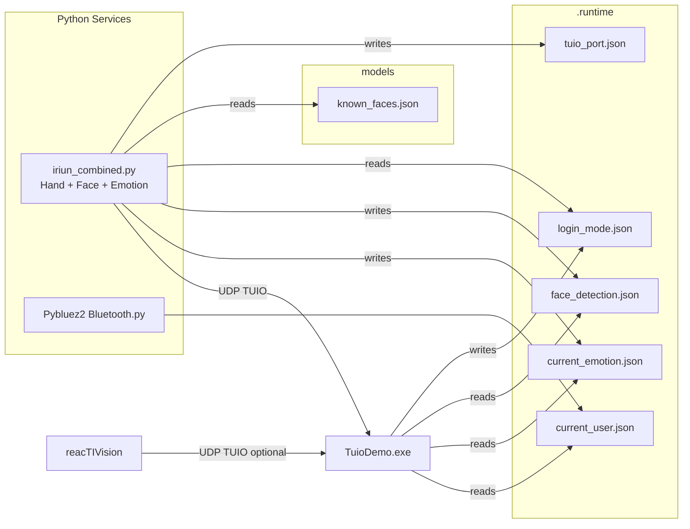

# Smart Shopping

Touchless kiosk demo with **hand tracking**, **face recognition login**, **emotion detection**, and **gender-based UI adaptation**. Built with **C# WinForms** (TuioDemo) and **Python** services for computer vision.

---

## Features

- 🖐️ **Touchless Hand Tracking** - Navigate using hand gestures via TUIO protocol
- 👤 **Face Recognition Login** - Automatic login with face detection and user recognition
- 😊 **Emotion Detection** - Real-time facial emotion analysis
- 👔👗 **Gender-Based UI** - Adaptive clothing display (dresses/skirts for female users, shirts/shorts for male users)
- 📱 **Bluetooth Sign-In** - Alternative login via paired Bluetooth devices
- 🎯 **Fiducial Markers** - Optional reacTIVision support for physical markers

---

## System Architecture



### Components

| Component | Role |
|-----------|------|
| **TuioDemo.exe** | Main C# WinForms app: TUIO listener, shopping UI, face recognition controller, gender-based UI adaptation |
| **bridge/iriun_combined.py** | Unified Python bridge: hand tracking → TUIO cursors, gesture recognition → TUIO objects, face emotion detection, face recognition with gender detection |
| **Pybluez2 Bluetooth.py** | Bluetooth device watcher → writes `.runtime/current_user.json` for alternative login |
| **reacTIVision** (optional) | Fiducial marker tracking → TUIO objects (separate camera, port 3333) |

---

## Requirements

### Software

- **Windows 10/11**
- **.NET Framework 4.7.2+** (Visual Studio 2022 Community recommended for building)
- **Python 3.9+** (Python 3.9-3.11 recommended)
- **MSBuild** (comes with Visual Studio or Build Tools)

### Python Packages

Install all required packages:

```powershell
pip install python-osc mediapipe opencv-python fer deepface tf-keras tensorflow winsdk pybluez2 numpy pillow
```

**Package details:**

- **mediapipe** (0.10.21 recommended) - Hand tracking and face mesh
- **opencv-python** - Camera access and image processing
- **fer** - Facial Expression Recognition for emotion detection
- **deepface** - Face recognition and gender detection (auto-downloads models on first run)
- **tensorflow** (2.x) - Required by DeepFace and FER
- **python-osc** - TUIO protocol communication
- **winsdk** + **pybluez2** - Bluetooth device detection (Windows only)

**Important:** Use MediaPipe 0.10.21 or similar that exposes `mediapipe.python.solutions`. Newer "tasks-only" builds may not work.

### Hardware

- **Webcam** - Iriun Webcam (phone as webcam) or any USB webcam
  - Install Iriun on phone (iOS/Android) and PC
  - Connect and ensure streaming before running
  - Usually appears as camera index 1
- **Bluetooth adapter** (optional) - For Bluetooth sign-in feature
- **Fiducial markers** (optional) - For reacTIVision tracking

---

## Quick Start

### First Time Setup

Before running the project for the first time, you need to build the C# application:

```powershell
msbuild TUIO_DEMO.csproj /p:Configuration=Debug
```

Or open `TUIO_DEMO.csproj` in Visual Studio 2022 and build (Ctrl+Shift+B).

### Option 1: Automated Launch (Recommended)

1. **Start Iriun Webcam** - Ensure phone and PC apps are connected and streaming

2. **Run the launcher script:**

```powershell
.\run_all.ps1
```

This script will:
- Start Bluetooth watcher (optional)
- Start the unified bridge (hand + face + emotion)
- Start reacTIVision (optional)
- Launch TuioDemo
- Clean up all processes when you close the app

**Script parameters:**

```powershell
.\run_all.ps1 -ShowPreview           # Show camera preview window
.\run_all.ps1 -SkipReacTIVision      # Don't start reacTIVision
.\run_all.ps1 -SkipBluetooth         # Don't start Bluetooth watcher
.\run_all.ps1 -IriunCameraIndex 0    # Use different camera index
.\run_all.ps1 -ListCameras           # List available cameras and exit
```

### Option 2: Manual Setup

#### Step 1: Build the C# Project

```powershell
msbuild TUIO_DEMO.csproj /p:Configuration=Debug
```

Or open `TUIO_DEMO.csproj` in Visual Studio and build.

#### Step 2: Start Python Services

**Terminal 1 - Bluetooth Watcher (optional):**
```powershell
python "Pybluez2 Bluetooth.py" --watch
```

**Terminal 2 - Unified Bridge (hand + face + emotion):**
```powershell
python bridge/iriun_combined.py
```

**Terminal 3 - reacTIVision (optional):**
```powershell
.\reacTIVision-1.5.1-win64\reacTIVision.exe
```

#### Step 3: Launch TuioDemo

```powershell
.\bin\Debug\TuioDemo.exe 3333
```

---

## Face Recognition Setup

### Enrolling Users

You can enroll new users using the dedicated enrollment script with your camera:

**For a male person:**
```powershell
python bridge/face_recognition_gender_bridge.py --enroll-person --person-name "Ahmed" --gender male --show-preview
```

**For a female person:**
```powershell
python bridge/face_recognition_gender_bridge.py --enroll-person --person-name "Sara" --gender female --show-preview
```

**Enrollment process:**
1. Run the enrollment command with the person's name and gender
2. Position your face in front of the camera
3. The system will capture 5 face samples from different angles
4. Move your head slightly between captures for better recognition
5. Press 'q' to quit enrollment early if needed
6. Data is automatically saved to `models/known_faces.json`

**Enrollment options:**
```powershell
# Capture more samples for better accuracy
python bridge/face_recognition_gender_bridge.py --enroll-person --person-name "John" --gender male --samples 10

# Enroll without preview window
python bridge/face_recognition_gender_bridge.py --enroll-person --person-name "Jane" --gender female
```

### Manual Enrollment (Alternative)

If you prefer to manually edit the database, add face data to `models/known_faces.json`:

```json
{
  "youssef": {
    "name": "youssef",
    "gender": "male",
    "embedding": [0.123, -0.456, ...]
  },
  "mariam": {
    "name": "mariam",
    "gender": "female",
    "embedding": [0.789, -0.012, ...]
  }
}
```

**To generate embeddings manually:**

```python
from deepface import DeepFace
import json

# Capture face embedding
result = DeepFace.represent(img_path="path/to/photo.jpg", model_name="Facenet")
embedding = result[0]["embedding"]

# Add to known_faces.json
data = {
    "username": {
        "name": "username",
        "gender": "male",  # or "female"
        "embedding": embedding
    }
}
```

### Gender-Based UI Adaptation

When a female user logs in:
- **Shirts** → **Dresses** (blackdress, flowerdress, reddress, etc.)
- **Shorts** → **Skirts** (blackskirt, pinkskirt, brownskirt, etc.)
- Category names and icons automatically update
- Applies to: Bestsellers, Deals, and Outfit Builder pages

Male users see the original shirts and shorts.

---

## Configuration Files

| File | Purpose |
|------|---------|
| **models/known_faces.json** | Face recognition database (name, gender, embedding) |
| **devices_db.json** | Allowed Bluetooth devices (MAC → name mapping) |
| **.runtime/face_detection.json** | Face recognition results (person_identity, gender, confidence) |
| **.runtime/current_emotion.json** | Real-time emotion detection results |
| **.runtime/login_mode.json** | Login page state (active/inactive) |
| **.runtime/current_user.json** | Bluetooth sign-in state |
| **.runtime/tuio_port.json** | TUIO port configuration |

---

## Usage

### Navigation

- **Hand Gestures:**
  - Move hand to control cursor
  - Swipe left/right to navigate between pages
  - Hover over buttons to select
  - Use fiducial markers for specific actions

### Login Methods

1. **Face Recognition (Primary):**
   - Go to Login/Signup page
   - Look at the camera
   - System detects and recognizes your face
   - Automatic login with 3-second delay
   - Shows "Welcome [Name]!" message

2. **Bluetooth Sign-In (Alternative):**
   - Pair your phone/headset with PC
   - Add device MAC to `devices_db.json`
   - Connect device
   - Automatic sign-in when detected

### Shopping Features

- **Home Page:** Browse Bestsellers and Deals
- **Clothes Page:** Select hoodies with quantity controls
- **Outfit Builder:** Create outfits with shirts/dresses, hoodies, jackets, pants, shorts/skirts
- **Cart:** Review and checkout selected items

---

## Troubleshooting

| Problem | Solution |
|---------|----------|
| **Camera not found** | Run `python bridge/iriun_combined.py --list-cameras` to find correct index |
| **Face not detected** | Ensure good lighting, face camera directly, check `.runtime/face_detection.json` |
| **ModuleNotFoundError** | Install missing package: `pip install <package-name>` |
| **DeepFace model download fails** | Check internet connection, models download on first run (~100MB) |
| **Gender detection wrong** | Update `known_faces.json` with correct gender value |
| **Bluetooth not working** | Check `devices_db.json`, ensure device is paired in Windows |
| **TUIO port mismatch** | Ensure all components use port 3333 (or same port) |
| **Build errors** | Install Visual Studio 2022 with .NET desktop development workload |
| **UTF-8 BOM errors** | Fixed in `iriun_combined.py` with `utf-8-sig` encoding |

### Debug Mode

Enable debug logging in the bridge:

```powershell
python bridge/iriun_combined.py --show-preview
```

This shows:
- Hand tracking landmarks
- Face detection boxes
- Emotion labels
- Recognition confidence

---

## Advanced Configuration

### Bridge Parameters

```powershell
python bridge/iriun_combined.py --help
```

Common options:
- `--camera-index 1` - Camera device index
- `--tuio-port 3333` - TUIO UDP port
- `--show-preview` - Show OpenCV preview window
- `--list-cameras` - List available cameras
- `--send-fps 30` - TUIO send rate limit

### Build Script Parameters

**run_all.ps1 (Main launcher):**

```powershell
.\run_all.ps1 -Help
```

Options:
- `-IriunCameraIndex 1` - Camera index for bridge (default: 1)
- `-TuioPort 3333` - TUIO UDP port (default: 3333)
- `-ShowPreview` - Enable OpenCV preview window
- `-SkipReacTIVision` - Don't start reacTIVision
- `-SkipBluetooth` - Don't start Bluetooth watcher
- `-SkipFaceHand` - Don't start face/hand bridge
- `-ListCameras` - List available cameras and exit
- `-PythonExe "python"` - Python executable path
- `-PythonVersion "-3.9"` - Python version for py launcher

**Alternative: start_tuio_integration.ps1**

Located in `bridge/` folder, this is an alternative launcher:

```powershell
.\bridge\start_tuio_integration.ps1 -SkipReacTIVision
```

---

## Project Structure

```
Smart_Shopping/
├── TuioDemo.cs                      # Main C# application
├── FaceRecognitionController.cs     # Face recognition logic
├── TUIO_DEMO.csproj                 # C# project file
├── run_all.ps1                      # Main automated launcher
├── stop_all.ps1                     # Stop all running processes
├── bridge/
│   ├── iriun_combined.py            # Unified bridge (hand + face + emotion)
│   ├── face_recognition_gender_bridge.py  # Standalone face recognition
│   ├── Face emotion bridge.py       # Standalone emotion detection
│   └── start_tuio_integration.ps1   # Alternative launcher
├── Pybluez2 Bluetooth.py            # Bluetooth watcher
├── devices_db.json                  # Bluetooth device database
├── models/
│   ├── known_faces.json             # Face recognition database
│   └── gesture_recognizer_dollarpy.pth  # Gesture templates
├── .runtime/                        # Runtime state files (gitignored)
│   ├── face_detection.json
│   ├── current_emotion.json
│   ├── login_mode.json
│   ├── current_user.json
│   └── tuio_port.json
├── Assests/
│   ├── Dark/                        # Dark theme images
│   └── Light/                       # Light theme images
└── reacTIVision-1.5.1-win64/        # Fiducial marker tracking
```

---

## Development

### Adding New Users

**Method 1: Using Enrollment Script (Recommended)**

```powershell
# For male users
python bridge/face_recognition_gender_bridge.py --enroll-person --person-name "Username" --gender male --show-preview

# For female users
python bridge/face_recognition_gender_bridge.py --enroll-person --person-name "Username" --gender female --show-preview
```

The script will:
1. Open your camera
2. Capture 5 face samples from different angles
3. Generate face embeddings using DeepFace
4. Save to `models/known_faces.json` automatically
5. No need to restart - changes are loaded on next recognition

**Method 2: Manual Database Edit**

1. Take a clear photo of the user's face
2. Generate embedding using DeepFace
3. Add to `models/known_faces.json` with name and gender
4. Restart the bridge to reload the database

### Adding New Clothing Items

1. Add images to `Assests/Dark/` and `Assests/Light/`
2. Update item arrays in `TuioDemo.cs`:
   - `maleItems` for male users
   - `femaleItems` for female users
3. Add image mapping in `GetGenderAppropriateImage()` if needed
4. Rebuild the project

### Modifying Face Recognition

- **Confidence threshold:** Adjust in `bridge/iriun_combined.py` (default 0.6)
- **Recognition model:** Change `model_name` in DeepFace calls (Facenet, VGG-Face, ArcFace, etc.)
- **Detection backend:** Modify `detector_backend` (opencv, ssd, dlib, mtcnn, retinaface)

---

## Known Issues

1. **First Run Delay:** DeepFace downloads models (~100MB) on first run
2. **Camera Conflicts:** Only one process can access the camera at a time
3. **Lighting Sensitivity:** Face recognition works best in good lighting
4. **Gender Detection:** Based on DeepFace model, may not be 100% accurate

---

## Documentation

- **FACE_RECOGNITION_INTEGRATION.md** - Face recognition implementation details
- **OUTFIT_BUILDER_GENDER_FIX.md** - Gender-based UI adaptation
- **LOGIN_SIGNUP_ALREADY_LOGGED_IN.md** - Login state management
- **CAMERA_CLOSE_FIX.md** - UTF-8 BOM fix for JSON parsing
- **HOW_TO_TEST_FACE_DETECTION.md** - Testing procedures

---

## License

Includes **TUIO** library and **reacTIVision** binaries under their respective licenses. See vendor README files for details.

---

## Credits

- **TUIO Protocol:** Martin Kaltenbrunner
- **MediaPipe:** Google
- **DeepFace:** Sefik Ilkin Serengil
- **FER:** Justin Shenk
- **reacTIVision:** Martin Kaltenbrunner & Ross Bencina

---

## Support

For issues or questions:
1. Check the Troubleshooting section
2. Review documentation files in the repository
3. Check `.runtime/` logs for error messages
4. Ensure all Python packages are installed correctly
5. Verify camera and Bluetooth hardware are working

---

**Version:** 2.0 (with Face Recognition & Gender-Based UI)
