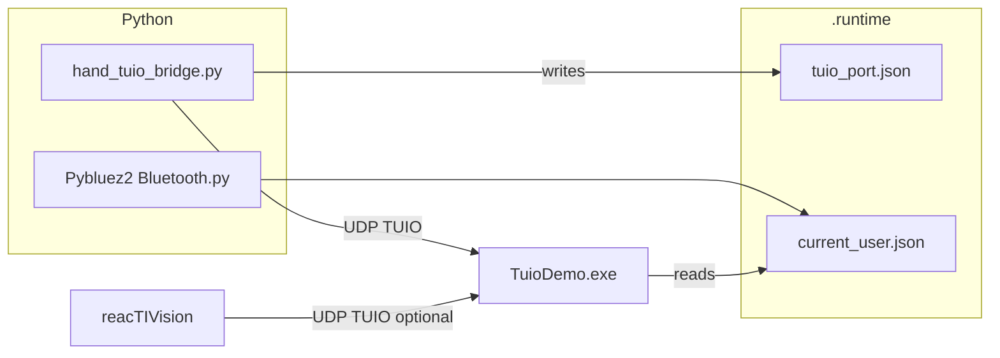

# Smart Shopping

Touchless kiosk demo: **hand tracking → TUIO** drives a **C# WinForms** app (`TuioDemo`), with optional **reacTIVision** fiducials and **Bluetooth** sign-in via a small Python watcher.

---

## What runs where

| Component | Role |
|-----------|------|
| **TuioDemo.exe** | Listens for **TUIO** (cursors + objects), renders the shopping UI, reads Bluetooth state from JSON. |
| **bridge/hand_tuio_bridge.py** | **MediaPipe** hands → **`/tuio/2Dcur`** cursors; **DollarPy** gestures → short **`/tuio/2Dobj`** bursts (SymbolID `1`) for swipe navigation; optional **YOLO best.pt** clothing detection → **`.runtime/current_clothing.json`** for Outfit Builder auto-category selection. |
| **Pybluez2 Bluetooth.py** | Polls Windows for allowed paired devices → writes **`.runtime/current_user.json`**. Use **`--watch`** for continuous updates (required while the app runs). |
| **reacTIVision** (optional) | Separate camera / TUIO source for **fiducial markers**; typically sends **`/tuio/2Dobj`** to **port 3333** by default. |



---

## Requirements

### Windows

- **.NET** — build/run `TUIO_DEMO.csproj` (Visual Studio or Build Tools with MSBuild).
- **Python 3.9** — recommended: **Visual Studio “Python 3.9”** or any 3.9 where you install the packages below. Avoid mixing `py -3.9` with a different install than the one you `pip install` into.

### Python packages

From the repo root:

```powershell
py -3.9 -m pip install -r requirements.txt
```

`requirements.txt` covers the bridge and notebooks. For the **full stack**, also install:

```powershell
py -3.9 -m pip install python-osc torch winsdk pybluez2 ultralytics
```

- **MediaPipe**: use a build that still exposes **`mediapipe.python.solutions`** (e.g. **0.10.21**). Newer “tasks-only” builds can break `hand_tuio_bridge.py`.
- **Bluetooth script**: needs **winsdk** + **pybluez2** (and a working Bluetooth stack).

### Hardware / apps

- **Iriun Webcam** (or similar) for hand tracking — start the phone and PC apps so the virtual camera is live before you run the bridge (often **camera index 1**).
- **reacTIVision** for fiducials — run it yourself when you need marker TUIO; it usually uses a separate camera and sends to port **3333** by default.

---

## Quick start (recommended)

1. **Manually open Iriun Webcam** — Phone + desktop app connected; wait until the virtual webcam is streaming (the hand bridge will open this camera by index).
2. **Manually open reacTIVision** — Start it when you use fiducials; keep its TUIO port aligned with **TuioDemo** (often **3333**). The hand bridge and reacTIVision are separate processes/cameras.
3. From the repository root in **PowerShell**, run the integration script (use **`-SkipReacTIVision`** if you already started reacTIVision yourself):

```powershell
.\bridge\start_tuio_integration.ps1 -SkipReacTIVision
```

That script typically:

1. Starts **`Pybluez2 Bluetooth.py --watch`** (updates `.runtime/current_user.json`).
2. Skips auto-launching reacTIVision when you passed **`-SkipReacTIVision`**; otherwise starts the bundled **reacTIVision.exe** if present.
3. Starts **`hand_tuio_bridge.py`** and writes **`.runtime/tuio_port.json`**.
4. Launches **`TuioDemo.exe`** with the UDP port from that file.
5. When you close TuioDemo, stops the bridge and Bluetooth watcher (and reacTIVision only if this script started it).

### Launcher parameters

| Parameter | Default | Notes |
|-----------|---------|--------|
| `-PythonExe` | `py` | Point at **`...\Python39_64\python.exe`** if `py` resolves to the wrong install. |
| `-PythonVersion` | `-3.9` | Only for the **`py`** launcher; not used as an argument when `-PythonExe` is `python.exe`. |
| `-CameraIndex` | `1` | Match your hand-tracking camera. |
| `-TuioPort` | `3333` | Must match what TuioDemo listens on (or use bridge `auto` + align config). |
| `-ShowPreview` | off | OpenCV preview with landmarks. |
| `-NoGesture` | off | Cursor only; no swipe → TUIO object bursts. |
| `-SkipReacTIVision` | off | Don’t start bundled reacTIVision. |
| `-SendFps` | `30` | Bridge send rate cap. |

Examples:

```powershell
.\bridge\start_tuio_integration.ps1 -ShowPreview
.\bridge\start_tuio_integration.ps1 -SkipReacTIVision -CameraIndex 0
```

Use **`py -3.9`** (default `-PythonExe py`, `-PythonVersion -3.9`) after installing packages with **`py -3.9 -m pip`** so the launcher and manual commands hit the same Python. If the Bluetooth child process fails silently, read **`.runtime/bluetooth_stderr.log`** and start the watcher manually (see below).

---

## Run pieces manually

### 1. Bluetooth sign-in (must stay running for login screen)

Always use **`--watch`** so disconnect/reconnect updates without restarting.

If **pybluez2** and **winsdk** are installed in **Visual Studio’s shared Python 3.9** (typical), run from the repo root:

```powershell
& "C:/Program Files (x86)/Microsoft Visual Studio/Shared/Python39_64/python.exe" ".\Pybluez2 Bluetooth.py" --watch
```

Optional polling interval (default is **1.5** seconds inside the script):

```powershell
& "C:/Program Files (x86)/Microsoft Visual Studio/Shared/Python39_64/python.exe" ".\Pybluez2 Bluetooth.py" --watch --interval 1.5
```

Same thing with the **`py`** launcher, if it points at that environment:

```powershell
py -3.9 ".\Pybluez2 Bluetooth.py" --watch --interval 1.5
```

One-shot (debug only):

```powershell
py -3.9 ".\Pybluez2 Bluetooth.py"
```

**Configure allowed devices** in **`devices_db.json`** (MAC → `name` / metadata). Only listed MACs can sign in.

**Run a single watcher** — multiple processes will fight over `.runtime/current_user.json`.

### 2. Hand → TUIO bridge

```powershell
py -3.9 .\bridge\hand_tuio_bridge.py --camera-index 1 --tuio-port 3333 --port-file .runtime/tuio_port.json --send-fps 30
```

Useful flags: `--show-preview`, `--list-cameras`, `--wait-for-camera`, `--use-dshow`, `--tuio-port auto`, `--no-gesture`.

### 3. TuioDemo

```powershell
.\bin\Debug\TuioDemo.exe 3333
```

Port **`3333`** must match the bridge (or reacTIVision) target. With no arguments, the app defaults to **3333** (see `Main` in `TuioDemo.cs`).

### Bluetooth JSON path

TuioDemo resolves **`.runtime/current_user.json`** next to the project when running from `bin/Debug` or `bin/Release` (see `ResolveBluetoothStatePath` in `TuioDemo.cs`). Keep that file updated by the Python watcher when testing login.

---

## TUIO and navigation

- **Cursors** — `/tuio/2Dcur` from the bridge (session IDs separate left/right hand).
- **Swipe navigation** — bridge emits brief **`/tuio/2Dobj`** sequences with **SymbolID = 1** and angle convention matching **`TuioDemo.cs`** (swipe templates use labels containing **`swipe_left`** / **`swipe_right`**).
- **reacTIVision** — separate TUIO source; default port is often **3333**; align **TuioDemo** listen port with whatever you run.
- **Outfit Builder auto-category** — bridge YOLO detection writes **`.runtime/current_clothing.json`**; when Outfit Builder is open, TuioDemo auto-locks the circular menu category (e.g., detected `pants` selects **Pants**).

---

## Configuration files

| Path | Purpose |
|------|---------|
| `devices_db.json` | Allowed Bluetooth MACs and display names for sign-in. |
| `.runtime/current_user.json` | Written by **`Pybluez2 Bluetooth.py`**; read by **TuioDemo** (`status`, `username`, `mac`, `selection_reason`, …). |
| `.runtime/current_clothing.json` | Written by bridge YOLO clothing detection; read by **TuioDemo** to auto-select Outfit Builder circular menu category. |
| `.runtime/bluetooth_seen_cache.json` | Internal ordering cache for “most recently connected” among allowed devices. |
| `.runtime/tuio_port.json` | Written by bridge: `{ "port": <int>, ... }` for launcher / debugging. |
| `models/gesture_recognizer_dollarpy.pth` | DollarPy gesture templates / model for the bridge. |

---

## Repository layout (high level)

```
Smart_Shopping/
├── TuioDemo.cs              # Main WinForms + TUIO listener + UI
├── TUIO_DEMO.csproj
├── bridge/
│   ├── hand_tuio_bridge.py
│   └── start_tuio_integration.ps1
├── Pybluez2 Bluetooth.py    # Bluetooth → current_user.json
├── devices_db.json
├── models/
├── .runtime/                # runtime JSON + logs (gitignored or local)
└── reacTIVision-1.5.1-win64/…
```

---

## Troubleshooting

| Symptom | Things to check |
|---------|------------------|
| **ModuleNotFoundError** (cv2, mediapipe, …) | Same interpreter for `pip` and `python` (`py -3.9 -m pip install …`). |
| **mediapipe has no `solutions`** | Downgrade to a classic solutions build (e.g. **0.10.21**). |
| **Login never updates** | Is **`Pybluez2 Bluetooth.py --watch`** running? Only one instance? Check **`.runtime/bluetooth_stderr.log`**. |
| **Disconnect still shows signed-in** | Use **`--watch`** with an up-to-date script (WinRT **`device.close()`** per poll). |
| **Wrong camera** | `.\bridge\hand_tuio_bridge.py --list-cameras` then set `--camera-index`. |
| **Bridge / TuioDemo port mismatch** | Same port everywhere; read `.runtime/tuio_port.json` after `auto`. |
| **TuioDemo won’t build** | Install MSBuild / VS workload; run `msbuild TUIO_DEMO.csproj /p:Configuration=Debug`. |

---

## Notebooks

`Threading.ipynb` and related notebooks document experiments (e.g. two processes for two cameras vs threads). Use **Python 3.9** kernel with the same deps as the bridge.

---

## License / third party

Includes **TUIO** library projects and bundled **reacTIVision** binaries under their respective terms; see vendor `README` files in subfolders.
